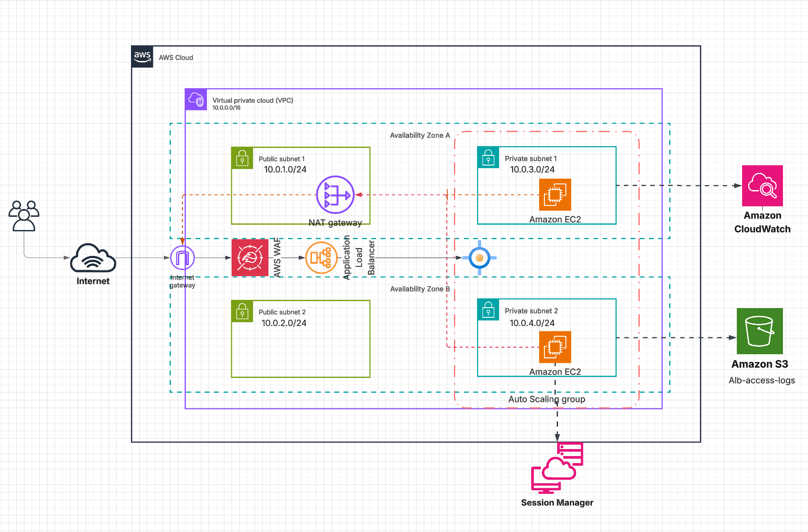
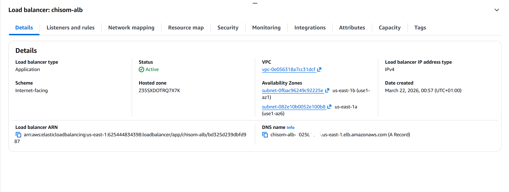
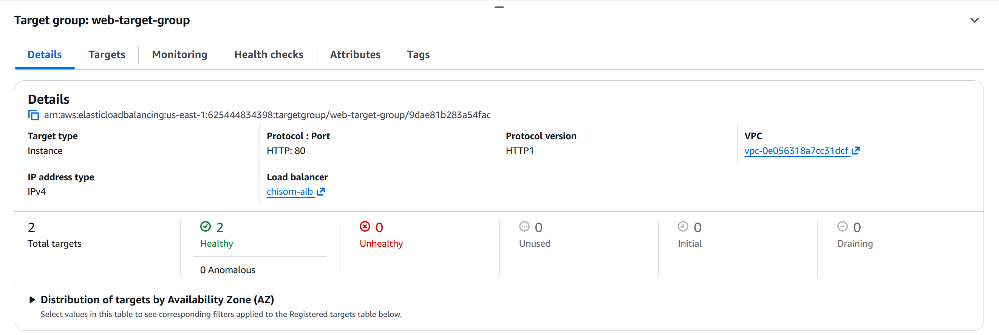
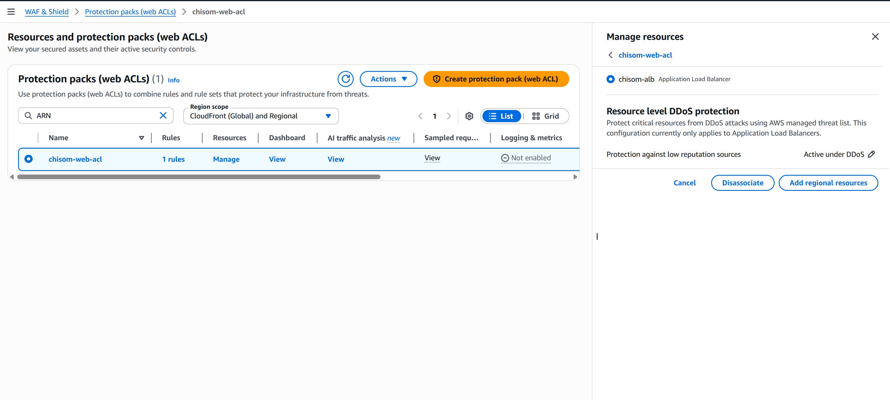
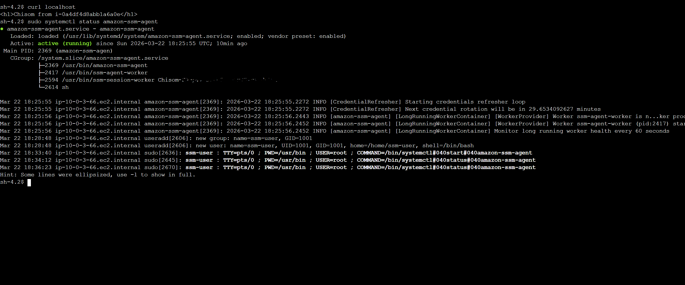
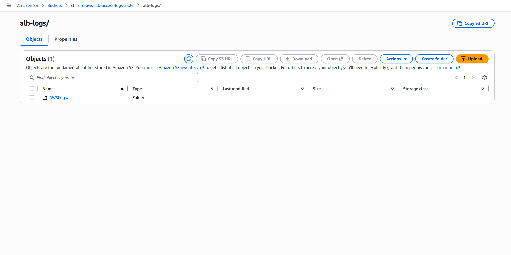
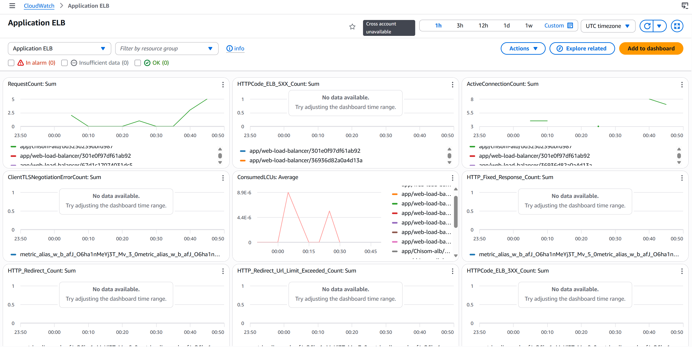

# Highly Available Web Infrastructure on AWS with Terraform

## Overview

This project provisions a **highly available and secure web infrastructure on AWS using Terraform**. The architecture simulates a production-ready environment capable of supporting scalable web applications across multiple availability zones.

The project demonstrates **Infrastructure as Code (IaC)** practices, automated provisioning, and secure cloud architecture using Terraform.

The infrastructure includes networking, load balancing, compute resources, security controls, and automated scaling.

---

## Architecture Diagram

<p align="center">
  
</p>

---

## AWS Services Used

The following AWS services are used in this project:

- Amazon VPC  
- Public and Private Subnets  
- Internet Gateway  
- NAT Gateway  
- Application Load Balancer  
- EC2 Auto Scaling Group  
- S3 bucket
- EC2 Instances running Nginx  
- AWS Systems Manager (SSM)  
- AWS WAF (Web Application Firewall)  
- Security Groups  
- Route Tables  

---

## Architecture Overview

This infrastructure follows a **highly available two-tier architecture**.
- Multi-AZ deployment
- Application Load Balancer
- Auto Scaling EC2 instances
- AWS WAF protection
- Secure instance access via Systems Manager
- Centralized logging with S3
- Monitoring with CloudWatch

  ## Request Flow

The request lifecycle in this architecture follows the path below:

1. A user sends a request from the browser to the application URL.
2. The request reaches the internet and enters the VPC through the Internet Gateway.
3. Traffic is inspected by Web Application Firewall (WAF) to block malicious requests.
4. Valid requests are forwarded to the Application Load Balancer.
5. The load balancer distributes traffic across EC2 Instances in multiple Availability Zones.
6. Instances are managed by an Auto Scaling Group.
7. Each EC2 Instance runs an Nginx web server.
8. The web server processes the request and returns a response to the load balancer.
9. The load balancer sends the response back to the user.

This architecture ensures high availability and fault tolerance across multiple availability zones.

### 1. Networking Layer

A custom VPC provides network isolation for the infrastructure.

The VPC contains:

- Two public subnets
- Two private subnets
- Internet Gateway for inbound traffic
- NAT Gateway for outbound internet access from private instances

Public subnets host the load balancer while application servers run in private subnets.

---

### 2. Load Balancing Layer

An Application Load Balancer distributes incoming HTTP traffic across EC2 instances in multiple availability zones.

This ensures:

- High availability
- Fault tolerance
- Even distribution of user requests

---

### 3. Compute Layer

Application servers run on EC2 instances deployed in private subnets.

These instances are managed by an Auto Scaling Group that:

- Maintains a minimum number of instances
- Automatically scales based on demand
- Ensures high availability

Each instance installs and runs **Nginx** automatically using a bootstrap script.

---

### 4. Security Layer

Several security mechanisms protect the infrastructure:

- Security Groups controlling inbound and outbound traffic
- Private subnet isolation for application servers
- AWS WAF protecting the load balancer
- Instance access via AWS Systems Manager instead of SSH
- NAT Gateway allows application servers access the internet

---

### 5. Instance Management

AWS Systems Manager allows secure access to EC2 instances without opening SSH ports.

This improves security by eliminating the need for public SSH access.

---

## Logging and Monitoring

The architecture implements centralized logging and monitoring for operational visibility.

### Application Load Balancer Access Logs

The Application Load Balancer is configured to store access logs in an Amazon S3 bucket. These logs capture detailed information about incoming requests including:

- Client IP address
- Request path
- Response codes
- Latency
- Target response status

These logs can be used for:

- Security analysis
- Traffic analysis
- Troubleshooting
- Compliance auditing

### Centralized Log Storage

All load balancer access logs are stored in an Amazon S3 bucket:
```
S3 Bucket: alb-access-logs
```

This enables long-term storage and integration with analytics tools.

### Monitoring with CloudWatch

Amazon CloudWatch is used to monitor system health and performance including:

- EC2 CPU utilization
- Auto Scaling Group metrics
- Application Load Balancer metrics
- Target group health checks

CloudWatch alarms can be configured to notify operators when thresholds are exceeded.

## Accessing the Application

After deployment, Terraform outputs the DNS name of the Application Load Balancer.

Open the DNS name in your browser to access the Nginx web page served by the EC2 instances.

---

## Security Best Practices Implemented

This project follows several cloud security best practices:

- Application servers deployed in private subnets
- No public SSH access to EC2 instances
- Secure access using AWS Systems Manager
- Web traffic protected using AWS WAF
- Controlled inbound traffic using security groups


## Infrastructure Screenshots

Below are screenshots from the deployed AWS environment demonstrating the infrastructure components.

### Application Load Balancer

<p align="center">
  
</p>

Shows the internet-facing Application Load Balancer distributing traffic to EC2 instances.

---

### Auto Scaling Group

<p align="center">
  
</p>

Demonstrates the Auto Scaling Group managing EC2 instances across multiple availability zones.

---

### EC2 Instances

<p align="center">
  
</p>

EC2 instances running Nginx in private subnets behind the load balancer.

---

### AWS WAF Protection

<p align="center">
  
</p>

AWS WAF attached to the Application Load Balancer providing web application protection.

---

### Systems Manager Session

<p align="center">
  
</p>

Secure shell access to EC2 instances using AWS Systems Manager Session Manager without exposing SSH ports.

---

### ALB Access Logs in S3

<p align="center">
  
</p>

Application Load Balancer access logs stored in Amazon S3 for centralized logging and auditing.

---

### CloudWatch Monitoring

<p align="center">
  
</p>

Amazon CloudWatch metrics and alarms monitoring the health and performance of the infrastructure.

---

## Cost Considerations

This architecture is designed with cost awareness while maintaining high availability and security.

### Compute

Amazon EC2 instances are deployed in an Auto Scaling Group to ensure that only the required number of instances are running based on traffic demand. This helps prevent over-provisioning and reduces unnecessary compute costs.

### Load Balancing

The Application Load Balancer distributes traffic efficiently across instances and only incurs cost based on usage.

### Monitoring

Amazon CloudWatch collects metrics and logs for monitoring system performance and operational health. Basic monitoring is enabled by default, while additional metrics can be enabled depending on operational requirements.

### Logging

Application Load Balancer access logs are stored in Amazon S3 for centralized logging and auditing. Lifecycle policies can be applied to automatically transition older logs to cheaper storage tiers or delete them after a defined retention period.

### Networking

A NAT Gateway is used to allow instances in private subnets to access the internet for updates and package installations while remaining inaccessible from the public internet. Although NAT Gateways incur hourly charges, they significantly simplify secure network architecture.

### Cost Optimization Opportunities

Potential improvements for cost efficiency include:

- Implementing S3 lifecycle policies for log retention
- Using smaller EC2 instance types for low-traffic environments
- Leveraging Reserved Instances or Savings Plans for long-term workloads
- Replacing NAT Gateway with NAT Instance for development environments

## Future Improvements

Planned improvements for future iterations include:

- Adding an RDS database for a complete three-tier architecture
- Creating reusable Terraform modules
- Implementing CI/CD pipelines
- Adding centralized monitoring and logging
- Implementing containerized workloads

---

## Author

**Chisom Eze**

Cloud & Infrastructure Engineer  

Focused on building scalable cloud infrastructure and applying cloud technologies to solve real-world problems in healthcare, finance, and emerging markets.
